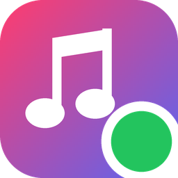

<p align="center"></p>

<h1 align="center">Apple Music Discord Presence</h1>

<p align="center">Show what you're playing in Apple Music on your Discord profile.</p>

<p align="center"><a href="https://github.com/grayfvll01/apple-music-discord-presence/releases/latest/download/AppleMusicDiscordPresence-Setup.exe"><b>Download for Windows</b></a></p>

---

- Song, artist, album art, time bar and clickable links on your status
- Only Apple Music is ever shown, and no ads or branding appear on your status
- A tiny tray app (about 115 KB) that updates itself

## Install

Run `AppleMusicDiscordPresence-Setup.exe`. It adds the app to the Start menu, and doesn't need admin rights.

It needs Windows 10 or 11, [Apple Music](https://apps.microsoft.com/detail/9pfhdd62mxs1) from the Microsoft Store, and the Discord desktop app.

## Use

Play something in Apple Music and your Discord status follows. All settings are in the tray icon's menu, next to the clock, and changes apply right away.

## Privacy

- Only the Apple Music app is read.
- Personal station names and your country never appear on your status.
- The app looks up album art with Apple's iTunes Search API, sending the song's title, artist and album. It also checks GitHub for updates. You can turn off both in the menu.

## Advanced

**More → Advanced settings file** opens `%APPDATA%\AppleMusicDiscordPresence\config.ini`, where every option is explained. Running `AppleMusicDiscordPresence.exe --dump` prints exactly what would be sent to Discord.

## Development

```
cargo test
cargo build --release
```

Versions follow [Semantic Versioning](https://semver.org). To release, add the version's notes to [CHANGELOG.md](CHANGELOG.md), then run `scripts\release.ps1 1.2.3`. GitHub Actions builds the installer and publishes the release, and installed copies update themselves.

## License

[MIT](LICENSE). Not affiliated with Apple or Discord.
